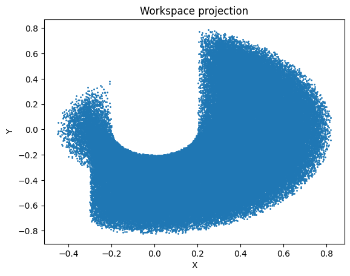
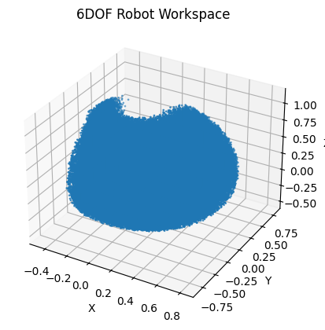
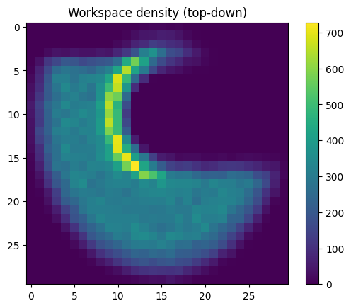

# 6DOF Robot Kinematics & Deep Learning IK Solver

This project implements a Forward Kinematics (FK) engine and a Deep Learning-based Inverse Kinematics (IK) solver for a 6-degree-of-freedom (6DOF) robotic arm.

## Overview

The project is contained within a Jupyter Notebook (`engine.ipynb`) and covers the following:

1.  **Forward Kinematics (FK) Engine**:
    *   Implementation of the Denavit-Hartenberg (DH) convention to calculate the end-effector pose (position and orientation) from joint angles.
    *   Extraction of pose vectors `[x, y, z, roll, pitch, yaw]`.

2.  **Workspace Analysis**:
    *   Generation of a large dataset (120,000 samples) of random joint configurations.
    *   Visualization of the robot's workspace using 2D projections, 3D scatter plots, and density heatmaps.

3.  **Inverse Kinematics (IK) with Deep Learning**:
    *   A Neural Network model built with TensorFlow/Keras to solve the Inverse Kinematics problem.
    *   The model learns to map end-effector poses back to joint angles (encoded as sin/cos values to handle periodicity).

## Dependencies

*   Python 3.x
*   NumPy
*   Matplotlib
*   TensorFlow / Keras

## Notebook Structure

### 1. FK Engine
Defines the `dh` transformation matrix and `forward_kinematics` function based on the robot's DH parameters.

### 2. Dataset Generation
Generates training data for the neural network.
*   **Dataset Size**: 120,000 data points.
*   **Inputs**: Random joint angles within defined limits.
*   **Outputs**: Calculated end-effector poses.
*   **Preprocessing**: Pose data (X) is normalized (standardized) using mean and standard deviation. Joint angles (Y) are converted to sin/cos pairs to avoid discontinuity issues at +/- 180 degrees.
*   **Files Saved**: `X_pose.npy` (Poses), `Y_sc.npy` (Sin/Cos of angles), `X_norm.npy` (Normalization parameters).

### 3. Deep Learning Model
*   **Architecture**: A Sequential model with Dense layers (256 -> 256 -> 128 -> 12).
*   **Input**: Normalized Pose (6 values: x, y, z, r, p, y).
*   **Output**: Sin and Cos values for the 6 joint angles (12 values).
*   **Loss Function**: Mean Squared Error (MSE).
*   **Optimizer**: Adam.
*   **Training**: 250 Epochs, Batch size 512, 20% Validation split.

## Usage

1.  Open `engine.ipynb` in Jupyter or Google Colab.
2.  Run the cells sequentially to generate the dataset, visualize the workspace, and train the Deep Learning model.
---

# v1.2 Test Results

The current model (v1.2) istrained on 120,000 samples shows the following performance characteristics:

*   **Training Convergence**: The model converges with a training loss (MSE) of approximately **0.21** and validation loss of **0.29** after 250 epochs.
*   **Accuracy**:
    *   **Position**: The model achieves an approximate positioning, with errors observed in the range of **0.5cm to 10cm** in random tests.
    *   **Orientation**: Orientation errors can be significant (up to several radians in some axes), indicating that the model captures the general configuration but struggles with precise orientation matching or handling multiple IK solutions.
*   **Conclusion**: The Deep Learning approach provides a fast approximation of the inverse kinematics solution. For high-precision applications, this prediction could be used as a "warm start" for a numerical IK solver (like Newton-Raphson).

### V1.2 model performance

    Target pose: [ 0.47877264 -0.36870386 -0.07176612 -1.13513172 -0.00418253 -2.80751752]

    Predicted pose: [ 0.48421468 -0.37649666 -0.17669175  1.8054063  -0.69120056 -0.19976898]

    Pose error: [-0.00544204  0.0077928   0.10492563 -2.94053802  0.68701803 -2.60774854]

---

### v1.2 dataset shape

